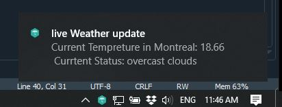

# Weather Desktop Notification
 Get up-to-date weather direct to your desktop, including meterological data and week-ahead predictions.
 You can get a weather update every 15 min (your choice) on your desktop.
 
 
 
 
## Install

### Dependencies

You need the following dependencies:

- python3
- pyowm
- win10toast


### Install the repo and the requirements

Clone the repo and install 3rd-party libraries.

```bash
$ git clone https://github.com/Kianoush-h/Weather-Desktop-Notification.git
$ cd Weather-Desktop-Notification
$ pip3 install -r requirements.txt
```

 
## Run the code

You can run the the code with this:

```
python3 Weather.py
```
After you run the mentioned code, you will see a desktop notification on your screen which is something like this:




 This notification apeas each 15 minutes which you can change it to your preferences.
 
 
 
## Example

Importing libraries 
 
 ```
import pyowm
from win10toast import ToastNotifier 
import time
 ```
 
 Desktop notification object
 
 ```
toaster = ToastNotifier() 
 ```


We need a function to fetch the weather and display it:

 ```
def weather ():
    owm = pyowm.OWM('your code from pyowm website')
    observation = owm.weather_at_place('Montreal,CA')
    w = observation.get_weather()
    
    temp = w.get_temperature('celsius')
    temp = str(temp['temp'])
    
    status = str(w.get_detailed_status())
    
    
    result = "Current Tempreture in Montreal: " + temp + "\n Currtent Status: " + status 
    toaster.show_toast("live Weather update", result, duration = 5,
                 icon_path="icon.ico", threaded=True) 

 ```
 
 
 Before we call the weather function we need to set the delay amount that we want:
 
  ```
delay =  60 * 15  #     60 s * 15 min
now = time.time()
old = now
weather()
 ```
 
 After all with this loop the weather notification will apear each 15 min:
 
  ```
while now < old + delay:
    
    if now + 5 >= old + delay:
        old  = time.time()
        weather()
    now  = time.time()
 
 ```
 
 
 
 
 
 
 # Future 
 You can modify this code to get an updated news from a website or elsewhere. The base of this project is the desktop notifier, hence you can combine it with any update notification-based app you want, email, YouTube notifier, news, articles from wikipedia, for inctance. 
 
 
 
 
 # Contact Me

Email: haratiank2@gmail.com

YouTube channel: https://www.youtube.com/channel/UCvf9_53f6n3YjNEA4NxAkJA?view_as=subscriber

GitHub: https://github.com/Kianoush-h

LinkedIn: https://www.linkedin.com/in/kianoush-haratiannejadi/

 
